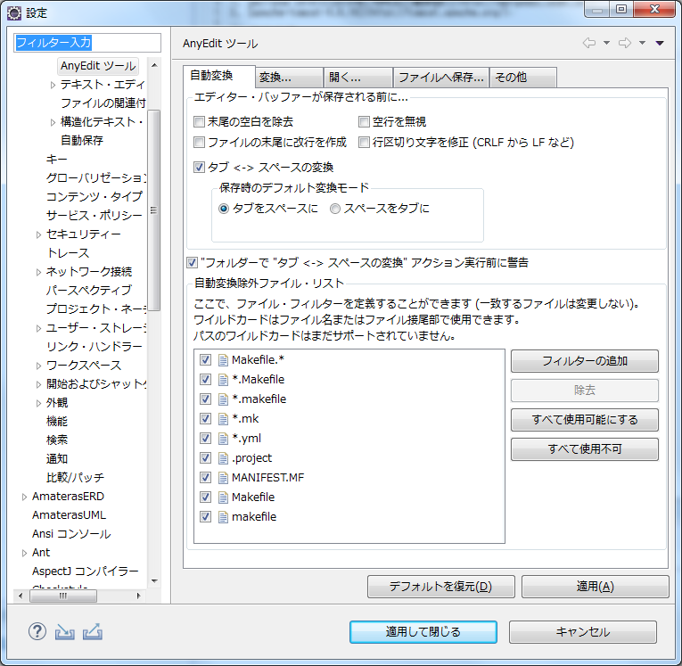

# eclipseの設定手順

#### 保存アクションを設定します。

プロジェクトによってルールは異なりますが、ここでは以下のようにすることにします。

##### 保存時、自動的にソースを整形するように設定します。(ウィンドウ→設定、Java→エディター→保存アクション)  

##### 末尾の空白除去、タブ<->スペース変換を設定します。(ウィンドウ→設定、一般→エディター→AnyEditツール)  

